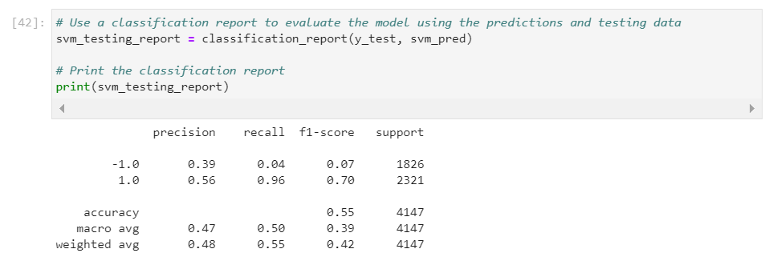
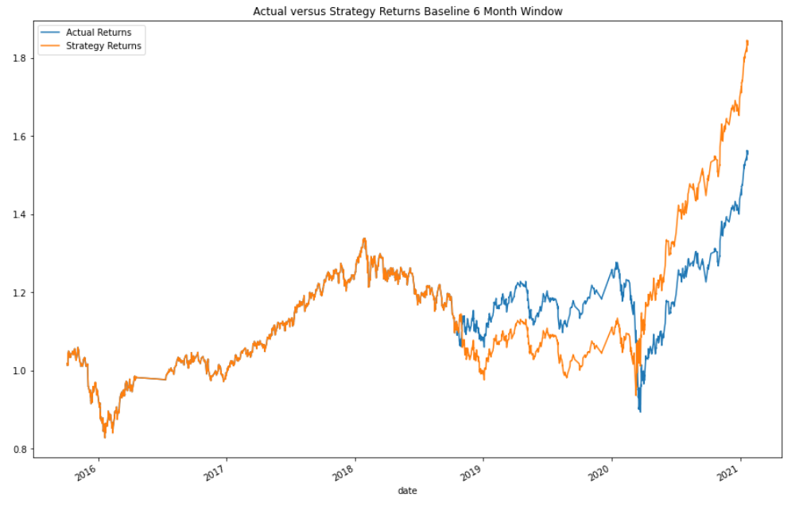

<!-- header is made with: https://github.com/kyechan99/capsule-render -->

[John Sung](https://linkedin.com/in/john-sung-3675569) 

                                                             
 
Columbia FinTech Bootcamp Assignment - Module 14

---

### Table of Contents

* [Overview](#overview)
* [Requirements](#requirements)
* [Data](#data)
* [Evaluation Report](#evaluation-report)
* [License](#license)

---

## Overview

The program was designed to improve the existing algorithmic trading systems and maintain the firm’s competitive advantage in the market. In order to enhance the existing trading signals with machine learning algorithms that can adapt to new data, the following was accomplished...

* Established a Baseline Performance

* Tuned the Baseline Trading Algorithm

* Evaluated a New Machine Learning Classifier

* Created an Evaluation Report

---

## Requirements

This project leverages python 3.7 and scikit-learn.

A [conda](https://docs.conda.io/en/latest/) environment with liabraries listed below and [Jupyter Notebook/Lab](https://jupyter.org/) are required to run the code.

The following library was used:

1. [Scikit Learn](https://scikit-learn.org/stable/index.html) - Scikit Learn or Sklearn is one of the most used Python libraries for Data Science, along with others like Numpy, Pandas, Tensorflow, or Keras.

Install the following librarie(s) in your terminal...

    pip install -U scikit-learn

---

## Data

The data used in this neural network model was from derived from a CSV file called emerging_markets_ohlcv.csv:

---

## Evaluation Report

The precision for the -1.0 declined but the recall improved from .04 to .44. The precision for 1.0 improved for .56 to .92 while the recall declined significantly from .96 to .56  

### Step 1: Tune the training algorithm by adjusting the size of the training dataset. 

To do so, slice your data into different periods. Rerun the notebook with the updated parameters, and record the results in your `README.md` file.

Baseline: 3 month window

Increase trading window to 6 months
 

Decrease trading window to 45 days

Answer the following question: What impact resulted from increasing or decreasing the training window? By increasing or decreasing the training window, the strategy results continued to outperform the actual results; however, the original 3 months displayed the best overall performance of the three scenarios from a standpoint of the strategy returns outperforming the actual returns throughout the majority of the time evaluated. However, the 6 month period displayed the best overall return of the strategy returns despite the actual returns outperforming the strategy returns for a significant portion of the time evaluated.

### Step 2: Tune the trading algorithm by adjusting the SMA input features. 

Adjust one or both of the windows for the algorithm. Rerun the notebook with the updated parameters, and record the results in your `README.md` file. 

Baseline: Short Window = 4 | Long Window = 100

Increase SMA long window to 200 days

Answer the following question: What impact resulted from increasing or decreasing either or both of the SMA windows? When the long window was increased from 100 and 200 days with the training window remaining contant at three months, the results were extremely volitile. You saw constant change on one outperforming the other. 

### Step 3: Choose the set of parameters that best improved the trading algorithm returns. 

Save a PNG image of the cumulative product of the actual returns vs. the strategy returns, and document your conclusion in your `README.md` file. Based on the visuals, the best set of parameters was the original SMA window and training windows. 

### Step 3: Backtest the new model to evaluate its performance. 

Save a PNG image of the cumulative product of the actual returns vs. the strategy returns for this updated trading algorithm, and write your conclusions in your `README.md` file. 

Answer the following questions: 
Did this new model perform better or worse than the provided baseline model? The 
Did this new model perform better or worse than your tuned trading algorithm? 

---

## License

MIT
